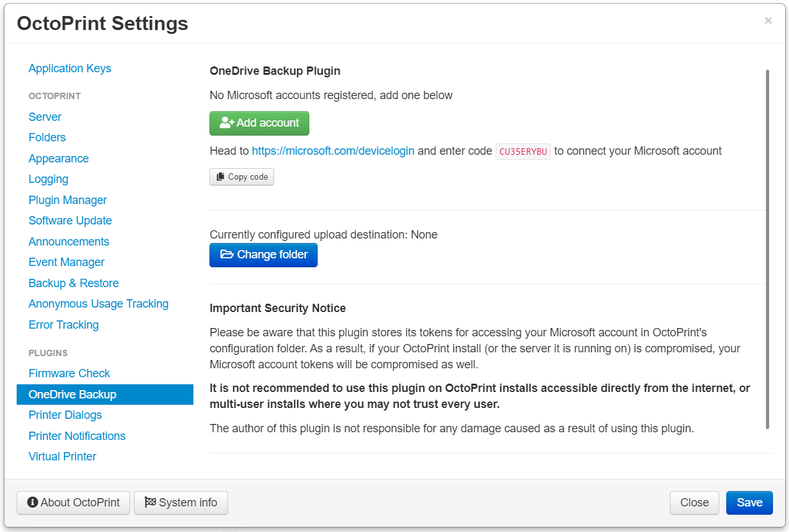
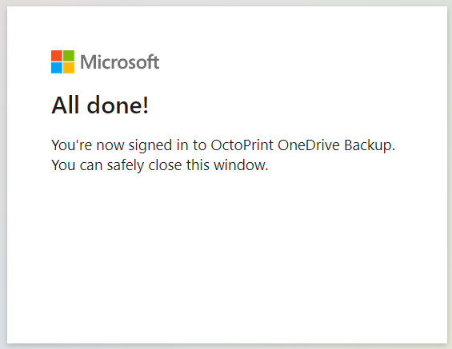
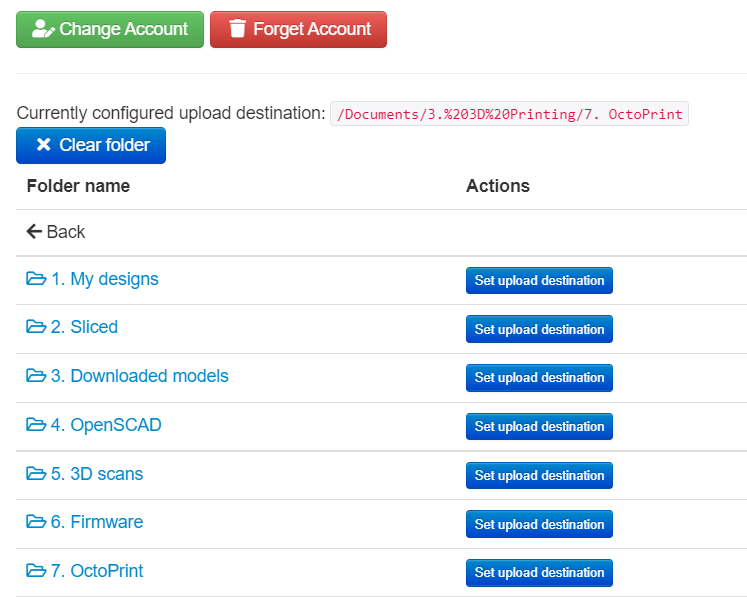
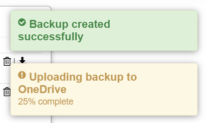

# OneDrive Backup Plugin

Automatically upload OctoPrint backups to OneDrive when they are created.

## Installation

Install the plugin via the bundled Plugin Manager or manually using this URL:
```
https://github.com/cp2004/OctoPrint-OneDrive-Backup/releases/latest/download/release.zip
```

**Warning**: This plugin requires Python 3.7 or newer to install. To find out more about upgrading your OctoPrint install
to use Python 3, you can take a look at [this post](https://community.octoprint.org/t/upgrading-your-octoprint-install-to-python-3/35158)

**Warning 2**: Don't try installing this plugin from the source code on GitHub, since it has a separate build step for the
frontend code. If you are insterested in installing from source to contribute, please see the [contributing guidelines](CONTRIBUTING.md)

## Configuration

Once the plugin is installed and loaded, you can set it up to connect to your Microsoft account.

### Adding your account



Select 'Add account' to generate a login code. Head to the URL linked to login with your account, entering the code
generated and logging in with your Microsoft account. Grant OctoPrint OneDrive Backup access to your files.

Once this is done, return the plugin, and it should show your account name & a success message.



### Configuring the backup upload



You can then configure the folder to save backups to. Select 'Change Folder' and then you should be able to navigate
through your OneDrive folders to find somewhere for backups to be saved.



Maybe give it a test after configuring it - head to the backup & restore tab and create a backup. Upload progress will
be shown in a notification in the UI.

## Important Security Notice

Please be aware that this plugin stores its tokens for accessing your Microsoft account in OctoPrint's
configuration folder, as expected. As a result, if your OctoPrint install (or the server it is running on) is
compromised, your files in OneDrive are at risk.

**It is not recommended to use this plugin on OctoPrint installs accessible directly from the
internet, or multi-user installs where you may not trust every user.**

The author of this plugin is not responsible for any damage caused as a result of using this plugin.

## Contributing

Please see the [contributing guidelines](CONTRIBUTING.md) for more information.

## Sponsors

* [SimplyPrint](https://simplyprint.io/)
* [@iFrostizz](https://github.com/iFrostizz)
* [@KenLucke](https://github.com/KenLucke)

As well as 5 others supporting me regularly through [GitHub Sponsors](https://github.com/sponsors/cp2004)!

## Supporting my efforts

I created this project in my spare time, so if you have found it useful or enjoyed using it then please consider [supporting it's development!](https://github.com/sponsors/cp2004). You can sponsor monthly or one time, for any amount you choose.
## ☁️
